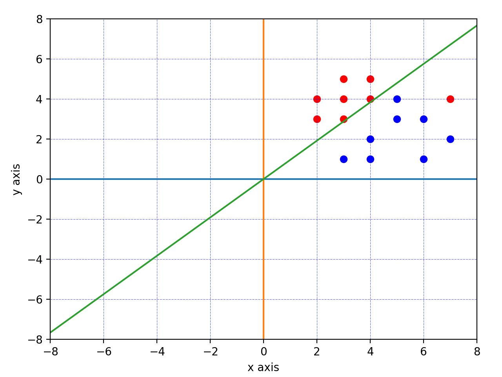
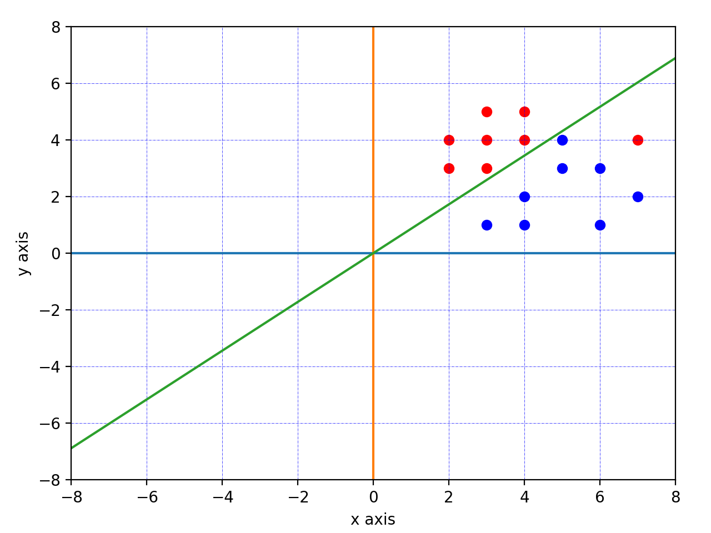
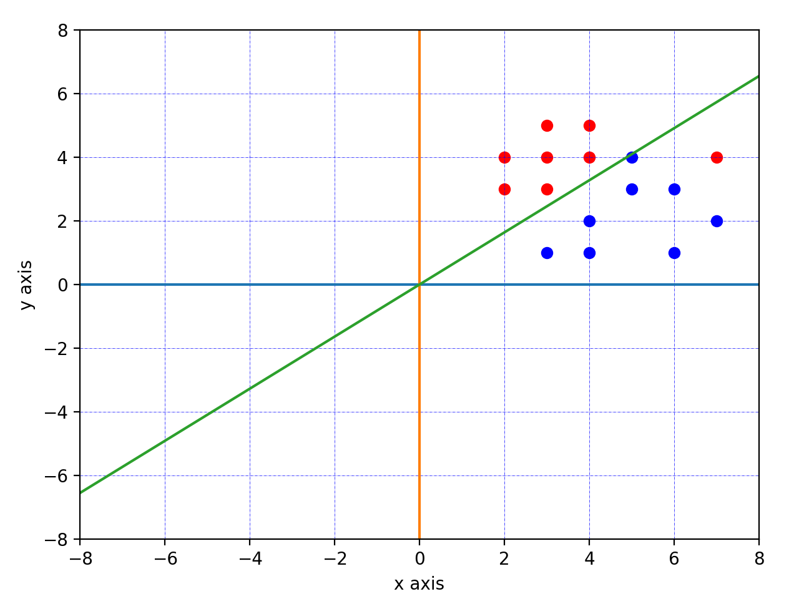

## Classification in Python
The implemented classify functions are:
* Pegasos_V1,
* Pegasos_V2,
* Perceptron,
* SDCA,
* SGD.

All of the implemented algorithms can be used to classify data sets.  

### Requirement
```
python==3.7.0
numpy==1.18.1
```
### How to use

Open test.py you will find some examples

```
import numpy as np
import src.classifier as classifier

X = np.array([[3,1],[4,1],[4,2],[5,3],[5,4],[6,1],[6,3],[7,2],\
              [2,3],[2,4],[3,3],[3,4],[3,5],[4,4],[4,5],[7,4]])

Y = np.array([-1,-1,-1,-1,-1,-1,-1,-1,\
              +1,+1,+1,+1,+1,+1,+1,+1])

cs = classifier.CLASSIFIER(x = X,        # inputs
                           y = Y,        # labels
                           T = 10000,    # iterations
                           lr_rate=1e-3) # learning rate
w = cs.Perceptron()
a = cs.plot(w)
```

### Experiments
We use matplotlib to draw the points X and their labels Y.  
The followings are the result from each classifier.  

#### SVM: Pegasos_V1 Classifier


#### SVM: Pegasos_V2 Classifier


#### Perceptron Classifier


#### SDCA Classifier


#### SGD Classifier


### Read more
If you would like to read more about these classifiers, it will be helpful for you to read the following links:   
[SVM](https://en.wikipedia.org/wiki/Support_vector_machine)   
[Pegasos](https://www.cs.huji.ac.il/~shais/papers/ShalevSiSrCo10.pdf)   
[SGD](https://en.wikipedia.org/wiki/Stochastic_gradient_descent)   
[SDCA](http://www.jmlr.org/papers/volume14/shalev-shwartz13a/shalev-shwartz13a.pdf)
